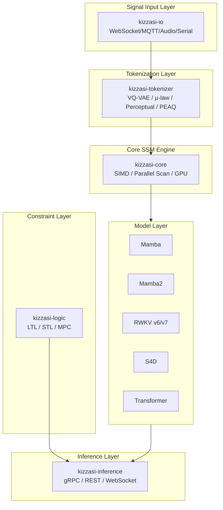
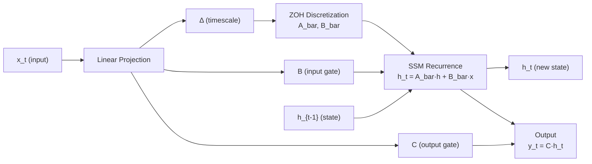
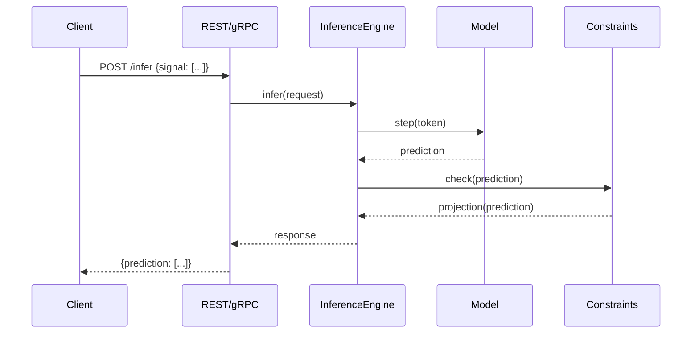
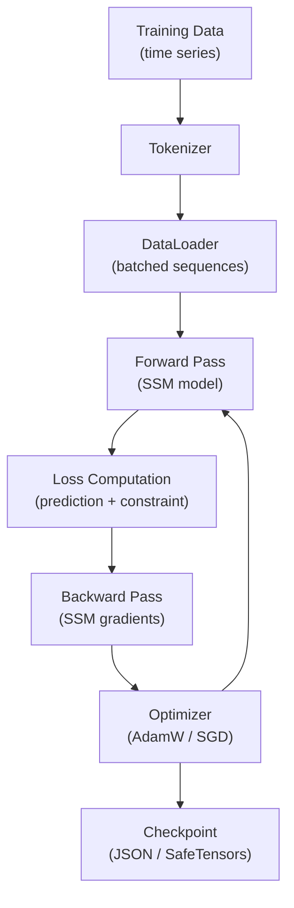

# Kizzasi (兆し)

**Autoregressive General-Purpose Signal Predictor (AGSP)**

[](https://crates.io/crates/kizzasi)
[](https://docs.rs/kizzasi)
[](LICENSE)
[](https://www.rust-lang.org/)

*"Predicting the flux of the world with the precision of logic."*

---

## Overview

**Kizzasi** (Japanese: 兆し, meaning "sign/omen/premonition") is a Rust-native autoregressive predictor designed for **continuous signal streams**—audio waveforms, sensor data, robotics control signals, and video frames. Unlike traditional Large Language Models (LLMs) that operate on discrete text tokens, Kizzasi is purpose-built for the continuous domain.

### The AGSP Paradigm

The term "Language Model" is a misnomer—what we actually have are **General-Purpose Signal Predictors**. Kizzasi embraces this insight:

- **Text tokens** are just one type of signal (discrete vocabulary indices)
- **Audio samples** are continuous signals (44.1kHz waveforms)
- **Sensor readings** are multivariate time series
- **Video frames** are high-dimensional spatial-temporal signals

All these modalities can be processed by the same autoregressive architecture: *predict the next value(s) based on history*.

### Core Innovation: Neuro-Symbolic Architecture

Kizzasi combines the **learning capability** of State Space Models (Mamba/RWKV/S4) with the **strict reliability** of TensorLogic constraints. This ensures predicted signals:

1. Follow statistical likelihoods (learned from data)
2. Adhere to physical laws (conservation, causality)
3. Respect safety constraints (bounds, rate limits)
4. Satisfy logical rules (domain-specific requirements)

---

## Architecture

```
┌─────────────────────────────────────────────────────────────────────────────────┐
│                                    kizzasi                                       │
│                              (Unified Facade API)                                │
├─────────────┬──────────────┬──────────────┬──────────────┬──────────────────────┤
│ kizzasi-    │  kizzasi-    │  kizzasi-    │  kizzasi-    │     kizzasi-io       │
│   core      │    model     │  tokenizer   │  inference   │  (World Connectors)  │
│  (Engine)   │   (Archs)    │  (Encoding)  │  (Pipeline)  │                      │
├─────────────┴──────────────┴──────────────┴──────────────┤                      │
│                       kizzasi-logic                       │                      │
│                  (Constraint Enforcement)                 │                      │
├───────────────────────────────────────────────────────────┴──────────────────────┤
│                            COOLJAPAN Ecosystem                                   │
│            scirs2-core  |  scirs2-signal  |  tensorlogic  |  candle              │
└──────────────────────────────────────────────────────────────────────────────────┘
```

### System Overview



### Mamba SSM Forward Pass



### Inference Pipeline



### Training Data Flow



### Crate Structure

| Crate | Description | SLoC |
|-------|-------------|------|
| [`kizzasi`](crates/kizzasi) | Unified facade with prelude and ergonomic API | ~7,400 |
| [`kizzasi-core`](crates/kizzasi-core) | SSM engine, embeddings, SIMD optimizations, parallel scan | ~18,500 |
| [`kizzasi-model`](crates/kizzasi-model) | Mamba/Mamba2, RWKV v5/v6/v7, S4/S4D, Transformer + training | ~39,200 |
| [`kizzasi-tokenizer`](crates/kizzasi-tokenizer) | VQ-VAE, μ-law, quantizers, multi-scale tokenization; multi-speaker, perceptual (Bark-scale), PEAQ quality evaluation | ~16,900 |
| [`kizzasi-inference`](crates/kizzasi-inference) | Pipeline orchestration, sampling, batching, gRPC/REST | ~11,000 |
| [`kizzasi-logic`](crates/kizzasi-logic) | Constraints, guardrails, projections, LTL/STL | ~20,400 |
| [`kizzasi-io`](crates/kizzasi-io) | MQTT, Audio, WebSocket, Serial, File, DSP, Beamforming | ~18,500 |
| [`kizzasi-embedded`](crates/kizzasi-embedded) | no_std SSM inference for edge devices | ~800 |
| [`kizzasi-python`](crates/kizzasi-python) | Python bindings via PyO3/maturin | ~700 |
| [`kizzasi-macros`](crates/kizzasi-macros) | Procedural macros for compile-time config | ~100 |
| [`kizzasi-webgpu`](crates/kizzasi-webgpu) | WebGPU/WGSL GPU acceleration kernels (SSM scan, matvec, SiLU, RMS-norm) | ~400 |

**Total: ~140,000+ lines of Rust code across 414 source files**

---

## Installation

Add to your `Cargo.toml`:

```toml
[dependencies]
kizzasi = "0.2"
```

### Feature Flags

| Feature | Description | Default |
|---------|-------------|:-------:|
| `std` | Standard library support | ✓ |
| `full` | Enable all features | ✓ |
| `io` | Physical world connectors | ✓ |
| `logic` | TensorLogic constraints | ✓ |
| `mqtt` | MQTT client (rumqttc) | ✓ |
| `audio` | Audio I/O (cpal) | ✓ |
| `async` | Async/streaming support | ○ |
| `mamba` | Mamba/Mamba2 models | ○ |

Minimal installation:
```toml
kizzasi = { version = "0.2", default-features = false, features = ["std"] }
```

---

## Quick Start

### Basic Prediction

```rust
use kizzasi::prelude::*;

fn main() -> KizzasiResult<()> {
    // Configure predictor with Mamba2 backend
    let config = KizzasiConfig::new()
        .model_type(ModelType::Mamba2)
        .input_dim(3)
        .output_dim(3)
        .hidden_dim(256)
        .state_dim(16)
        .num_layers(4)
        .context_window(8192);

    let mut predictor = Kizzasi::new(config)?;

    // Single step prediction (O(1) complexity)
    let input = array![0.1, 0.2, 0.3];
    let output = predictor.step(&input)?;

    println!("Predicted: {:?}", output);
    Ok(())
}
```

See [`crates/kizzasi/examples/getting_started.rs`](crates/kizzasi/examples/getting_started.rs) for a step-by-step tutorial covering tokenization, inference, and constraint enforcement.

### With Safety Constraints

```rust
use kizzasi::prelude::*;

fn main() -> KizzasiResult<()> {
    let config = KizzasiConfig::new()
        .model_type(ModelType::Rwkv)
        .input_dim(3)
        .output_dim(3);

    let mut predictor = Kizzasi::new(config)?;

    // Define safety constraints
    let guardrails = GuardrailSet::new()
        .add(Guardrail::new(
            ConstraintBuilder::new()
                .name("velocity_limit")
                .bound(0, BoundType::Range(-1.0, 1.0))  // Clamp to [-1, 1]
                .bound(1, BoundType::LessThan(100.0))   // Max value < 100
                .build()?
        ))
        .add(Guardrail::new(
            ConstraintBuilder::new()
                .name("rate_limit")
                .rate_limit(0.1)  // Max change per step
                .build()?
        ));

    predictor.set_guardrails(guardrails);

    // Predictions automatically satisfy constraints
    let input = array![0.5, 0.5, 0.5];
    let safe_output = predictor.step(&input)?;

    Ok(())
}
```

### Real-Time Audio Processing

```rust
use kizzasi::prelude::*;

fn main() -> KizzasiResult<()> {
    // Use audio preset for optimized configuration
    let config = KizzasiConfig::audio_preset()
        .sample_rate(44100.0);

    let mut predictor = Kizzasi::new(config)?;

    // Stream from microphone
    let audio_config = AudioConfig::new()
        .sample_rate(44100)
        .channels(1)
        .buffer_size(1024);

    let mut audio = AudioInput::new(audio_config)?;
    audio.start()?;

    loop {
        let buffer = audio.read()?;
        for sample in buffer.iter() {
            let prediction = predictor.step(&array![*sample])?;
            // Use prediction for audio effect, anomaly detection, etc.
        }
    }
}
```

### Multi-Step Prediction

```rust
use kizzasi::prelude::*;

fn main() -> KizzasiResult<()> {
    let config = KizzasiConfig::new()
        .model_type(ModelType::S4D)
        .input_dim(6)
        .output_dim(6);

    let mut predictor = Kizzasi::new(config)?;

    // Predict N steps into the future
    let initial = array![0.0, 0.0, 0.0, 1.0, 0.0, 0.0];
    let trajectory = predictor.predict_n(&initial, 100)?;

    println!("Predicted {} future states", trajectory.len());
    Ok(())
}
```

---

## Model Architectures

Kizzasi supports multiple state-of-the-art sequence modeling architectures:

| Model | Per-Step Complexity | State Size | Best For |
|-------|:-------------------:|:----------:|----------|
| **Mamba2** | O(1) | O(d·N) | Default choice, balanced |
| **RWKV** | O(1) | O(d) | Lightweight, fast |
| **S4D** | O(1) | O(d·N) | Smooth dynamics |
| **Transformer** | O(L) | O(L·d) | Baseline comparison |

### Architecture Selection Guide

```rust
// High-performance, long context
ModelType::Mamba2  // Selective SSM with SSD

// Lightweight, embedded systems
ModelType::Rwkv    // Linear attention, minimal state

// Smooth signal dynamics
ModelType::S4D     // HiPPO initialization, diagonal SSM

// Comparison/research
ModelType::Transformer  // Standard attention (O(N) per step)
```

---

## Constraint System

### Constraint Types

| Type | Description | Example |
|------|-------------|---------|
| `Range(min, max)` | Value in [min, max] | Joint angles |
| `LessThan(max)` | Upper bound | Velocity limits |
| `GreaterThan(min)` | Lower bound | Minimum pressure |
| `RateLimit(delta)` | Max change per step | Smooth motion |
| `Linear(a, b)` | a·x ≤ b | Conservation laws |
| `Quadratic(Q, c, b)` | x'Qx + c'x ≤ b | Energy bounds |
| `Temporal(LTL)` | Always/Eventually/Until | Safety properties |

### Training Integration

Constraints can be enforced during training as differentiable losses:

```rust
use kizzasi_logic::{ConstraintAwareLoss, LagrangianRelaxation};

// Combine task loss with constraint violation penalty
let loss = ConstraintAwareLoss::new()
    .task_loss(mse_loss)
    .constraint_loss(guardrails.violation_loss(&prediction))
    .weight(0.1);

// Or use Lagrangian relaxation for adaptive weighting
let relaxation = LagrangianRelaxation::new(guardrails)
    .learning_rate(0.01);
```

---

## Tokenization Strategies

Kizzasi provides multiple signal-to-token conversion strategies:

| Tokenizer | Type | Vocab Size | Best For |
|-----------|:----:|:----------:|----------|
| `ContinuousTokenizer` | Continuous | ∞ | Default, floating-point signals |
| `VQVAETokenizer` | Discrete | Configurable | Learned codebooks |
| `MuLawCodec` | Discrete | 256/65536 | Audio compression |
| `LinearQuantizer` | Discrete | 2^bits | Simple quantization |
| `MultiScaleTokenizer` | Hierarchical | Variable | Multi-resolution |
| `PyramidTokenizer` | Residual | Variable | Progressive refinement |

```rust
use kizzasi_tokenizer::{VQVAETokenizer, VQConfig};

// Create VQ-VAE tokenizer with 1024 codebook entries
let config = VQConfig::new()
    .codebook_size(1024)
    .embed_dim(256)
    .ema_decay(0.99);

let tokenizer = VQVAETokenizer::new(config)?;

let tokens = tokenizer.encode(&signal)?;
let reconstructed = tokenizer.decode(&tokens)?;
```

---

## Use Cases

### 1. Robotics Control

Real-time motor control with safety bounds:

```rust
let config = KizzasiConfig::robotics_preset()
    .input_dim(12)   // 6 joint positions + 6 velocities
    .output_dim(6);  // 6 torque commands

let guardrails = GuardrailSet::new()
    .add(joint_limits())      // Physical joint ranges
    .add(velocity_limits())   // Maximum angular velocities
    .add(torque_limits());    // Actuator saturation
```

### 2. Industrial Anomaly Detection

Predictive maintenance for IoT sensors:

```rust
let config = KizzasiConfig::sensor_preset()
    .input_dim(32);  // 32 sensor channels

// Train on "normal" operation data
// At runtime, large prediction errors indicate anomalies
let prediction = predictor.step(&sensor_reading)?;
let anomaly_score = (prediction - actual).mapv(|x| x.abs()).sum();
```

### 3. Audio Synthesis

Next-sample prediction for audio effects:

```rust
let config = KizzasiConfig::audio_preset()
    .model_type(ModelType::Rwkv);  // Fast, lightweight

// WaveNet-style sample-by-sample generation
let mut predictor = Kizzasi::new(config)?;
for sample in input_audio.iter() {
    let next_sample = predictor.step(&array![*sample])?;
    output_audio.push(next_sample[0]);
}
```

### 4. Video Frame Prediction

Anime in-betweening and frame interpolation:

```rust
let config = KizzasiConfig::new()
    .model_type(ModelType::Mamba2)
    .input_dim(1024)   // Frame embedding dimension
    .output_dim(1024);

// Enforce skeleton/pose constraints
let guardrails = GuardrailSet::new()
    .add(bone_length_constraints())
    .add(joint_angle_limits());
```

---

## Performance

### Inference Characteristics

| Metric | Mamba2 | RWKV | S4D | Transformer |
|--------|:------:|:----:|:---:|:-----------:|
| Per-step latency | ~100μs | ~50μs | ~80μs | ~500μs |
| Memory (state) | O(d·N) | O(d) | O(d·N) | O(L·d) |
| Context length | Unlimited | Unlimited | Unlimited | Fixed L |
| Training parallel | ✓ | ✓ | ✓ | ✓ |

### Optimization Features

- **SIMD Vectorization**: Optimized dot products, layer norms, softmax
- **Parallel Scan**: O(log N) depth parallel SSM scan
- **Memory Pooling**: Reusable array allocations
- **Batch Processing**: Efficient multi-sequence inference
- **Continuous Batching**: Dynamic batch formation for streaming

---

## COOLJAPAN Ecosystem

Kizzasi is part of the COOLJAPAN scientific computing ecosystem:

| Crate | Purpose |
|-------|---------|
| [scirs2-core](https://crates.io/crates/scirs2-core) | Array operations, random, SIMD |
| [scirs2-signal](https://crates.io/crates/scirs2-signal) | Signal processing algorithms |
| [scirs2-fft](https://crates.io/crates/scirs2-fft) | Fast Fourier Transform |
| [scirs2-linalg](https://crates.io/crates/scirs2-linalg) | Linear algebra |
| [scirs2-series](https://crates.io/crates/scirs2-series) | Time-series utilities |
| [tensorlogic-ir](https://crates.io/crates/tensorlogic-ir) | Neuro-symbolic constraints |
| [candle-core](https://crates.io/crates/candle-core) | ML backend (GPU acceleration) |
| [oxifft](https://crates.io/crates/oxifft) | Fast Fourier Transform |
| [oxicode](https://crates.io/crates/oxicode) | Binary serialization |
| [oxirs-core](https://crates.io/crates/oxirs-core) / [oxirs-gql](https://crates.io/crates/oxirs-gql) | RDF/GraphQL data layer |
| [wgpu](https://crates.io/crates/wgpu) | GPU compute backend |

See [KIZZASI_POLICY.md](KIZZASI_POLICY.md) for dependency guidelines.

---

## Project Statistics

```
===============================================================================
 Language            Files        Lines         Code     Comments       Blanks
===============================================================================
 Dockerfile              1           53           26           14           13
 JavaScript              1          142          104           18           20
 Makefile                1          191          135           28           28
 Python                  7          503          347           45          111
 Shell                   3          313          232           37           44
 TOML                   15         1164          743          291          130
 YAML                    1           41           38            0            3
-------------------------------------------------------------------------------
 HTML                    2           96           88            0            8
 |- CSS                  2          103          103            0            0
 |- JavaScript           2          266          209           22           35
 (Total)                            465          400           22           43
-------------------------------------------------------------------------------
 Jupyter Notebooks       3            0            0            0            0
 |- Markdown             3          169            1          127           41
 |- Python               3          690          537           57           96
 (Total)                            859          538          184          137
-------------------------------------------------------------------------------
 Markdown               40        11367            0         8752         2615
 |- BASH                15          214          126           57           31
 |- Dockerfile           1           19           19            0            0
 |- Python               3           97           67           12           18
 |- Rust                27         2673         1889          346          438
 |- TOML                17          113           88           18            7
 |- YAML                 1           27           25            0            2
 (Total)                          14510         2214         9185         3111
-------------------------------------------------------------------------------
 Rust                  414       179123       140465        10842        27816
 |- Markdown           408        23463          858        19105         3500
 (Total)                         202586       141323        29947        31316
===============================================================================
 Total                 488       192993       142178        20027        30788
===============================================================================

Tests: 2,567 passing (default features) / 2,744 passing (all-features) | Clippy: 0 warnings | Rustdoc: 0 warnings (strict)
```

---

## Contributing

Contributions are welcome! Please read [CONTRIBUTING.md](CONTRIBUTING.md) for guidelines.

### Development Setup

```bash
git clone https://github.com/cool-japan/kizzasi
cd kizzasi
cargo build --all-features
cargo test --all-features
```

### Code Quality

```bash
# Format
cargo fmt

# Lint
cargo clippy --all-features

# Benchmarks
cargo bench

# Documentation
cargo doc --all-features --no-deps
```

---

## Sponsorship

Kizzasi is developed and maintained by **COOLJAPAN OU (Team Kitasan)**.

If you find Kizzasi useful, please consider sponsoring the project to support continued development of the Pure Rust ecosystem.

[](https://github.com/sponsors/cool-japan)

**[https://github.com/sponsors/cool-japan](https://github.com/sponsors/cool-japan)**

Your sponsorship helps us:
- Maintain and improve the COOLJAPAN ecosystem
- Keep the entire ecosystem (OxiBLAS, OxiFFT, SciRS2, etc.) 100% Pure Rust
- Provide long-term support and security updates

## License

Licensed under the Apache License, Version 2.0 ([LICENSE](LICENSE) or http://www.apache.org/licenses/LICENSE-2.0).

---

## Acknowledgments

- The COOLJAPAN ecosystem contributors
- Mamba/S4 research teams at CMU and Princeton
- RWKV community
- The Rust ML ecosystem (candle, burn)

---

*Kizzasi: Sensing the future, one prediction at a time.*
