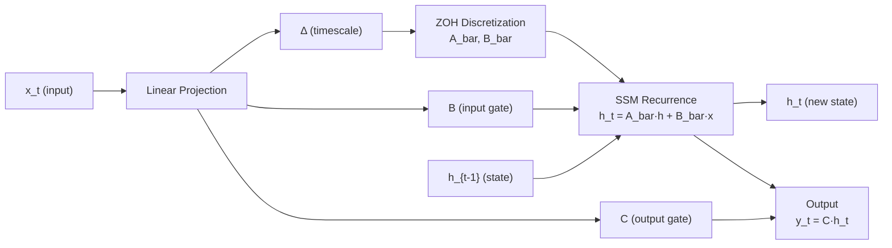

# kizzasi-model

Model architectures for Kizzasi AGSP - Mamba, RWKV, S4, Transformer.

## Overview

Production-ready implementations of state-of-the-art sequence models with unified interfaces. All models support O(1) recurrent inference for streaming applications.

## Features

- **Mamba & Mamba2**: Selective state space models with SSD
- **RWKV v5/v6/v7**: Receptance Weighted Key Value architecture
- **S4/S4D/S5**: Structured state space models with HiPPO initialization
- **H3**: Hungry Hungry Hippos with shift SSMs
- **Transformer**: KV-cache optimized attention
- **Hybrid**: Combined Mamba + Attention architectures
- **MoE**: Mixture of Experts layer with routing strategies

## Quick Start

```rust
use kizzasi_model::{Mamba, MambaConfig, AutoregressiveModel};

// Create Mamba model
let config = MambaConfig::base(32, 64); // input_dim, hidden_dim
let mut model = Mamba::new(config)?;

// Single-step inference
let input = Array1::zeros(32);
let output = model.forward(&input)?;

// Or use presets
let tiny_model = Mamba::tiny(32, 32);  // For edge devices
let large_model = Mamba::large(64, 1024); // High accuracy
```

## Supported Models

| Model | Complexity | Memory | Best For |
|-------|------------|--------|----------|
| Mamba2 | O(1) | Low | Real-time streaming |
| RWKV | O(1) | Very Low | Long sequences |
| S4D | O(1) | Low | Continuous signals |
| Transformer | O(n²) | High | Short contexts |
| Hybrid | O(n) | Medium | Balanced performance |

## Mamba SSM Forward Pass



## Documentation

- [API Documentation](https://docs.rs/kizzasi-model)
- [Kizzasi Repository](https://github.com/cool-japan/kizzasi)

## License

Licensed under the Apache License, Version 2.0.
